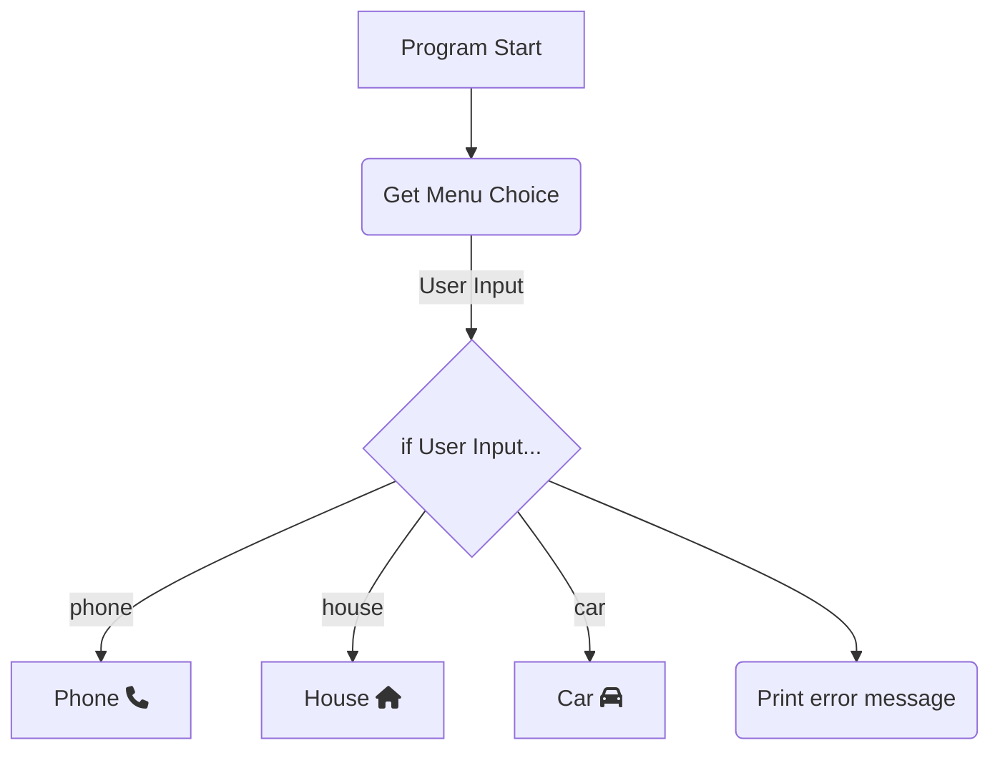

import {MdxLayout} from '@/components/mdx-layout'
import TextArea from '@/components/mdx-textarea'
import {PythonScriptRenderer, tooltipConfig} from '@components/python-code-viewer'

<TextArea>
# What is a Logic Diagram? 
A logic diagram is another tool programmers can use to break down the flow of logic in their programs and plan out their projects. We may
provide you logic diagrams, alongside a way to interpret them, such as a table outlining what certain shapes or icons mean. There are different
standards for logic diagrams in programming and engineering, which try to use similar shaping and structure; however, this is not a perfect
system. 

If making a logic-diagram of your own, the important things to note are the shapes for:
 - Program entry
 - Conditional-points 
 - Loops
 - Functions

<br/ >
This will allow you to plan out the control flow throughout your program. Consider this program diagram:

<br/ >
We might implement this program like this:

<PythonScriptRenderer
    code={`user_choice = input("Which menu do you want?")

if user_choice == "phone":
    Phone() # Call phone function
elif user_choice == "house":
    House() # Call house function
elif user_choice == "car":
    Car() # Call car function
else:
    print("Please enter one of the following options: car, phone, or house.")
    `}
    tooltips={tooltipConfig}
    theme="dark"
    showLineNumbers={true}
    copyButton={true}
    className="mb-6"
/>

We implemented something to collect the menu choice and print the error message, and we used an if-statement on the User's input just like the
diagram outlined. However, more serious programs make this more beneficial. Consider this diagram:

It's a lot even with the diagram, but it'd be worse if it were just code - even if it were simplified psuedocode. One would typically use a
diagram to outline the overall functionality of a program (specifically the decisions we make throughout the program) and then use psuedocode
to plan out the specific details.

 
## Links
 - [Draw.io](https://www.drawio.com/) is a program that allows you to make your own logic diagrams.
</TextArea>

export default function MDXPage({ children }) {
  return <MdxLayout>{children}</MdxLayout>
}